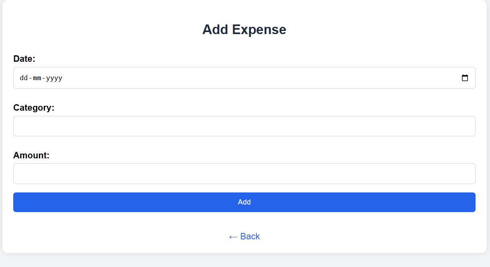
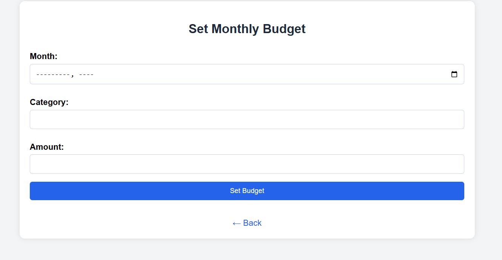
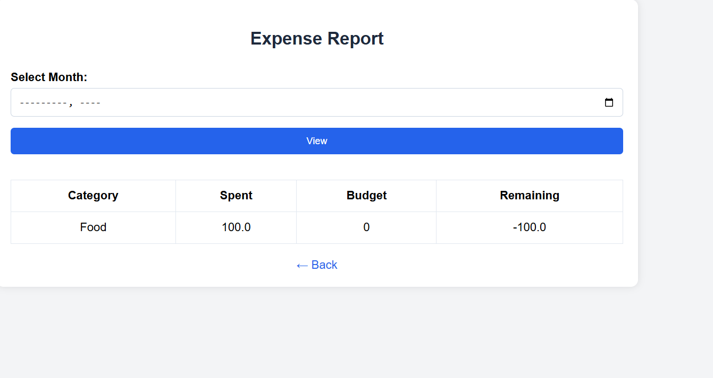
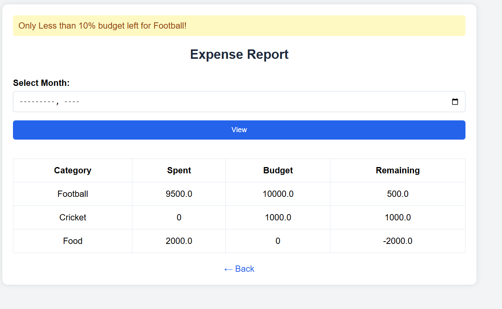

# Expense Tracker Web App

A simple and user-friendly Flask-based web application to **track daily expenses**, **set monthly budgets**, and **generate reports** to monitor your spending habits. The app allows you to add expenses, define category-wise budgets, and view alerts when you're close to overspending.

---

## Features

- Add daily expenses with date, category, and amount
- Set monthly budget limits by category
- View detailed monthly reports of expenses vs budget
- Get alert if 90% or more of the budget is spent
- Clean and modern UI with navigation buttons

---

## Test steps and UI Preview

### ➕ Add Expense
- Enter the **date** in `DD-MM-YYYY` format
- Add the **category** (e.g., Food, Travel)
- Enter the **amount spent**
- Click **"Add"** to save the expense
- Click **"← Back"** to return to the homepage

---

### Set Monthly Budget
- Select the **month** using the calendar
- Add the **category** you want to set a budget for
- Enter the **budget amount**
- Click **"Set Budget"** to save
- Click **"← Back"** to return to the homepage

---

### View Monthly Report
- Choose a **month** to generate a report
- View the **category-wise summary** with:
  - **Spent** amount
  - **Budget** set
  - **Remaining** amount

- If remaining budget is **less than or equal to 10%**, a **warning message** is displayed eg. **“Only Less than 10% budget left for Shopping!”).**

**Sample Report:**

| Category  | Spent   | Budget  | Remaining |
|-----------|---------|---------|-----------|
| Cricket   | 950.0   | 0       | -950.0    |
| Shopping  | 1950.0  | 2000.0  | 50.0      |

---

## Technologies Used

- Python 3.x
- Flask (Web Framework)
- SQLite (Database)
- HTML/CSS (Frontend)
- Jinja2 (Templating)
- Bootstrap (Styling)

---

## Project Structure

- `app.py`: Main Flask app
- `templates/`: All HTML pages (add_expense, index, report, set_budget , view_expenses, base)
- `static/`: Adding Styles to Web Pages
- `schema.sql`: SQL file to create the database
- `expenses.db`: SQLite database (auto-created)
- `requirements.txt`: Python dependencies
- `Dockerfile`: For running the app with Docker

---

## Database

- Uses **SQLite**
- Tables: `expenses`, `budget`
- Database created using `schema.sql`

